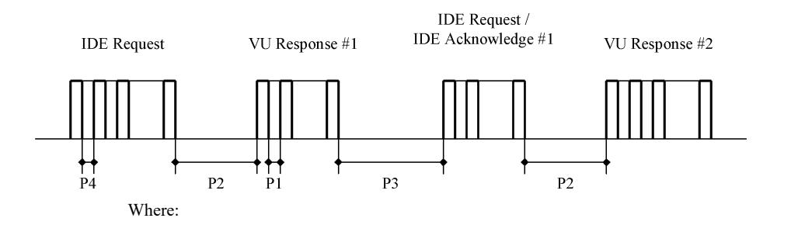
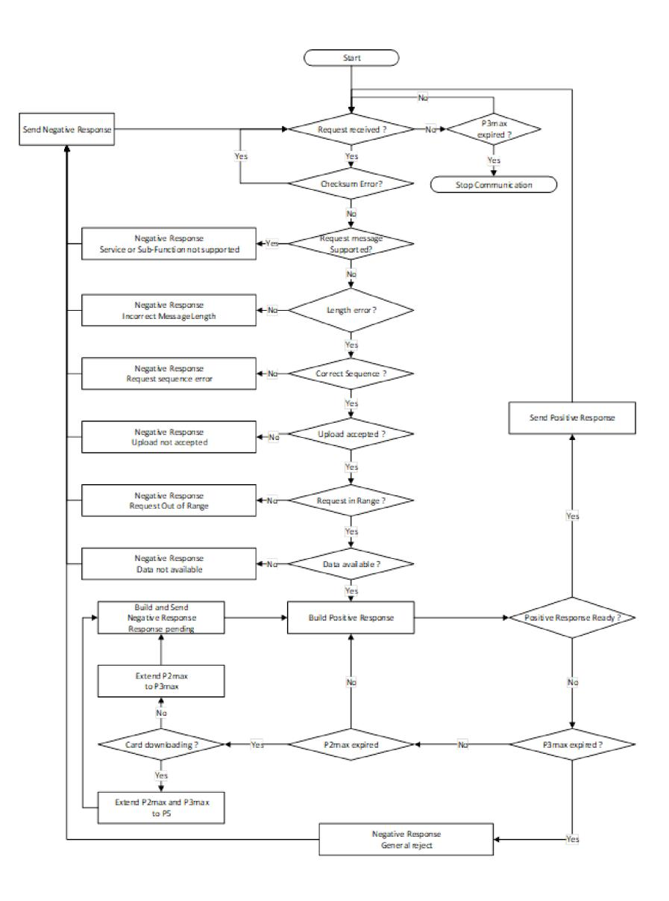

### *Appendix 7*

## **DATA DOWNLOADING PROTOCOLS**

### TABLE OF CONTENT

| TABLE OF CONTENT |                                                  |                                                                                                                                                                                                                                                                                                                                                                  |
|------------------|--------------------------------------------------|------------------------------------------------------------------------------------------------------------------------------------------------------------------------------------------------------------------------------------------------------------------------------------------------------------------------------------------------------------------|
| 1.               | INTRODUCTION                                     |                                                                                                                                                                                                                                                                                                                                                                  |
| 1.1.             | Scope                                            |                                                                                                                                                                                                                                                                                                                                                                  |
| 1.2.             | Acronyms and notations                           |                                                                                                                                                                                                                                                                                                                                                                  |
| 2.               | V.U. DATA DOWNLOADING                            |                                                                                                                                                                                                                                                                                                                                                                  |
| 2.1.             | Download procedure                               |                                                                                                                                                                                                                                                                                                                                                                  |
| 2.2.             | Data download protocol                           |                                                                                                                                                                                                                                                                                                                                                                  |
| 2.2.1            | Message structure                                |                                                                                                                                                                                                                                                                                                                                                                  |
| 2.2.2            | Message types                                    |                                                                                                                                                                                                                                                                                                                                                                  |
| 2.2.2.1          | Start Communication Request (SID 81)             |                                                                                                                                                                                                                                                                                                                                                                  |
| 2.2.2.2          | Positive Response Start Communication (SID C1)   |                                                                                                                                                                                                                                                                                                                                                                  |
| 2.2.2.3          | Start Diagnostic Session Request (SID 10)        |                                                                                                                                                                                                                                                                                                                                                                  |
| 2.2.2.4          | Positive Response Start Diagnostic (SID 50)      |                                                                                                                                                                                                                                                                                                                                                                  |
| 2.2.2.5          | Link Control Service (SID 87)                    |                                                                                                                                                                                                                                                                                                                                                                  |
| 2.2.2.6          | Link Control Positive Response (SID C7)          |                                                                                                                                                                                                                                                                                                                                                                  |
| 2.2.2.7          | Request Upload (SID 35)                          |                                                                                                                                                                                                                                                                                                                                                                  |
| 2.2.2.8          | Positive Response Request Upload (SID 75)        |                                                                                                                                                                                                                                                                                                                                                                  |
| 2.2.2.9          | Transfer Data Request (SID 36)                   |                                                                                                                                                                                                                                                                                                                                                                  |
| 2.2.2.10         | Positive Response Transfer Data (SID 76)         |                                                                                                                                                                                                                                                                                                                                                                  |
| 2.2.2.11         | Request Transfer Exit (SID 37)                   |                                                                                                                                                                                                                                                                                                                                                                  |
| 2.2.2.12         | Positive Response Request Transfer Exit (SID 77) |                                                                                                                                                                                                                                                                                                                                                                  |
| 2.2.2.13         | Stop Communication Request (SID 82)              |                                                                                                                                                                                                                                                                                                                                                                  |
| 2.2.2.14         | Positive Response Stop Communication (SID C2)    |                                                                                                                                                                                                                                                                                                                                                                  |
| 2.2.2.15         | Acknowledge Sub Message (SID 83)                 |                                                                                                                                                                                                                                                                                                                                                                  |
| 2.2.2.16         | Negative Response (SID 7F)                       |                                                                                                                                                                                                                                                                                                                                                                  |
| ▼B               |                                                  |                                                                                                                                                                                                                                                                                                                                                                  |
|                  | 2.2.5                                            | Error handling                                                                                                                                                                                                                                                                                                                                                   |
|                  | 2.2.5.1                                          | Start Communication phase                                                                                                                                                                                                                                                                                                                                        |
|                  | 2.2.5.2                                          | Communication phase                                                                                                                                                                                                                                                                                                                                              |
|                  | 2.2.6                                            | Response Message content                                                                                                                                                                                                                                                                                                                                         |
| ▼M3              |                                                  |                                                                                                                                                                                                                                                                                                                                                                  |
|                  | 2.2.6.1                                          | Positive Response Transfer Data Download Interface Version                                                                                                                                                                                                                                                                                                       |
|                  | 2.2.6.2                                          | Positive Response Transfer Data Overview                                                                                                                                                                                                                                                                                                                         |
|                  | 2.2.6.3                                          | Positive Response Transfer Data Activities                                                                                                                                                                                                                                                                                                                       |
|                  | 2.2.6.4                                          | Positive Response Transfer Data Events and Faults                                                                                                                                                                                                                                                                                                                |
|                  | 2.2.6.5                                          | Positive Response Transfer Data Detailed Speed                                                                                                                                                                                                                                                                                                                   |
|                  | 2.2.6.6                                          | Positive Response Transfer Data Technical Data                                                                                                                                                                                                                                                                                                                   |
| ▼B               |                                                  |                                                                                                                                                                                                                                                                                                                                                                  |
|                  | 2.3.                                             | ESM File storage                                                                                                                                                                                                                                                                                                                                                 |
|                  | 3.                                               | TACHOGRAPH CARDS DOWNLOADING PROTOCOL                                                                                                                                                                                                                                                                                                                            |
|                  | 3.1.                                             | Scope                                                                                                                                                                                                                                                                                                                                                            |
|                  | 3.2.                                             | Definitions                                                                                                                                                                                                                                                                                                                                                      |
|                  | 3.3.                                             | Card Downloading                                                                                                                                                                                                                                                                                                                                                 |
|                  | 3.3.1                                            | Initialisation sequence                                                                                                                                                                                                                                                                                                                                          |
|                  | 3.3.2                                            | Sequence for un-signed data files                                                                                                                                                                                                                                                                                                                                |
|                  | 3.3.3                                            | Sequence for Signed data files                                                                                                                                                                                                                                                                                                                                   |
|                  | 3.3.4                                            | Sequence for resetting the calibration counter.                                                                                                                                                                                                                                                                                                                  |
|                  | 3.4.                                             | Data storage format                                                                                                                                                                                                                                                                                                                                              |
|                  | 3.4.1                                            | Introduction                                                                                                                                                                                                                                                                                                                                                     |
|                  | 3.4.2                                            | File format                                                                                                                                                                                                                                                                                                                                                      |
|                  | 4.                                               | DOWNLOADING A TACHOGRAPH CARD VIA A VEHICLE UNIT.                                                                                                                                                                                                                                                                                                             |
|                  | 1.                                               | INTRODUCTION                                                                                                                                                                                                                                                                                                                                                     |
|                  |                                                  | This appendix specifies the procedures to follow in order to perform the different types of data download to an External Storage Medium, together with the protocols that must be implemented to assure the correct data transfer and the full compatibility of the downloaded data format to allow any controller to inspect these data and be able |

- 2.2.3 Message flow
- 2.2.4 Timing

## **M1**

1.1. **Scope**

Data may be downloaded to an ESM:

— from a Vehicle Unit by an Intelligent Dedicated Equipment (IDE) connected to the VU,

to control their authenticity and their integrity before analysing them.

— from a tachograph card by an IDE fitted with a card interface device (IFD),

— from a tachograph card via a vehicle unit by an IDE connected to the VU.

To give the possibility to verify the authenticity and integrity of downloaded data stored on an ESM, data is downloaded with a signature appended in accordance with Appendix 11 Common Security Mechanisms. The source equipment (VU or card) identification and its security certificates (Member state and equipment) are also downloaded. The verifier of the data must possess independently a trusted European public key.

Data downloaded from a VU are signed using Appendix 11 Common Security Mechanisms Part B (Second-generation tachograph system), except when drivers' control is performed by a non EU control authority, using a first generation control card, in which case data are signed using Appendix 11 Common Security Mechanisms Part A (First-generation tachograph system), as requested by Appendix 15 Migration, requirement MIG\_015.

This Appendix specifies therefore two types of data downloads from the VU:

- Generation 2 type of VU data download, providing the generation 2 data structure, signed using Appendix 11 Common Security Mechanisms Part B,
- Generation 1 type of VU data download, providing the generation 1 data structure, signed using Appendix 11 Common Security Mechanisms Part A.

Similarly, there are two types of data downloads from second generation driver cards inserted in a VU, as specified in paragraphs 3 and 4 of this Appendix.

#### **B** 1.2. **Acronyms and notations**

The following acronyms are used in this appendix:

- **AID** Application Identifier
- **ATR** Answer To Reset
- **CS** Checksum byte
- **DF** Dedicated File
- **DS\_** Diagnostic Session
- **EF** Elementary File
- **ESM** External Storage Medium
- **FID** File Identifier (File ID)
- **FMT** Format Byte (first byte of message header)
- **ICC** Integrated Circuit Card
- **IDE** Intelligent Dedicated Equipment: The equipment used to perform data downloading to the ESM (e.g. Personal Computer)
- **IFD** Interface Device
- **KWP** Keyword Protocol 2000
- **LEN** Length Byte (last byte of message header)
- **PPS** Protocol Parameter Selection
- **PSO** Perform Security Operation
- **SID** Service Identifier
- **SRC** Source byte
- **TGT** Target Byte

## **M1**

- **TLV** Tag Length Value
- **TREP** Transfer Response Parameter
- **TRTP** Transfer Request Parameter
- **VU** Vehicle Unit
- 2. V.U. DATA DOWNLOADING

##### 2.1. **Download procedure**

In order to carry on a VU data download, the operator must perform the following operations:

- Insert his tachograph card inside a card slot of the VU (\*);
- Connect the IDE to the VU download connector;
- Establish the connection between the IDE and the VU;
- Select on the IDE the data to download and send the request to the VU;
- Close the download session.

##### 2.2. **Data download protocol**

The protocol is structured on a master-slave basis, with the IDE playing the master role and the VU playing the slave role.

The message structure, types and flow are principally based on the Keyword Protocol 2000 (KWP) (ISO 14230-2 Road vehicles — Diagnostic systems — Keyword protocol 2000 — Part2: Data link layer).

The application layer is principally based on the current draft to date of ISO 14229-1 (Road vehicles — Diagnostic systems — Part 1: Diagnostic services, version 6 of 22 February 2001).

#### 2.2.1 *Message structure*

DDP\_002 All the messages exchanged between the IDE and the VU are formatted with a structure consisting of three parts:

- Header composed by a Format byte (FMT), a Target byte (TGT), a Source byte (SRC) and possibly a Length byte (LEN),
- Data field composed by a Service Identifier byte (SID) and a variable number of data bytes, which can include an optional diagnostic session byte (DS\_) or an optional transfer parameter byte (TRTP or TREP).

— Checksum composed by a Checksum byte (CS).

| Header  |     |     |     | Data field    |      |     |     |     | Checksum |
|---------|-----|-----|-----|---------------|------|-----|-----|-----|----------|
| FMT     | TGT | SRC | LEN | SID           | DATA | ... | ... | ... | CS       |
| 4 bytes |     |     |     | Max 255 bytes |      |     |     |     | 1 byte   |

The TGT and SRC byte represent the physical address of the recipient and originator of the message. Values are F0 Hex for the IDE and EE Hex for the VU.

The LEN byte is the length of the Data field part.

(\*) The card inserted will trigger the appropriate access rights to the downloading function and to the data. It shall, however, be possible to download data from a driver card inserted into one of the VU slots when no other card type is inserted in the other slot.

The Checksum byte is the 8 bit sum series modulo 256 of all the bytes of the message excluding the CS itself.

FMT, SID, DS\_, TRTP and TREP bytes are defined later in this document.

- DDP\_003 In the case where the data to be carried by the message is longer than the space available in the data field part, the message is actually sent in several sub messages. Each sub message bears a header, the same SID, TREP and a 2-byte sub message counter indicating the sub message number within the total message. To enable error checking and abort the IDE acknowledges every sub message. The IDE can accept the sub message, ask for it to be re-transmitted, request the VU to start again or abort the transmission.
- DDP\_004 If the last sub message contains exactly 255 bytes in the data field, a final sub message with an empty (except SID TREP and sub message counter) data field must be appended to show the end of the message.

##### *Example:*

| Header  | SID                   | TREP | Message | CS |
|---------|-----------------------|------|---------|----|
| 4 Bytes | Longer than 255 Bytes |      |         |    |

Will be transmitted as:

| Header  | SID       | TREP | 00 | 01 | Sub message 1 | CS |
|---------|-----------|------|----|----|---------------|----|
| 4 Bytes | 255 Bytes |      |    |    |               |    |
| Header  | SID       | TREP | 00 | 02 | Sub message 2 | CS |
| 4 Bytes | 255 Bytes |      |    |    |               |    |

...

| Header  | SID                 | TREP | xx | yy | Sub message n | CS |
|---------|---------------------|------|----|----|---------------|----|
| 4 Bytes | Less than 255 Bytes |      |    |    |               |    |

or as:

| Header  | SID       | TREP | 00 | 01 | Sub message 1 | CS |
|---------|-----------|------|----|----|---------------|----|
| 4 Bytes | 255 Bytes |      |    |    |               |    |
| Header  | SID       | TREP | 00 | 02 | Sub message 2 | CS |

| 4 Bytes | 255 Bytes |
|---------|-----------|
|---------|-----------|

...

| Header  | SID       | TREP | xx | yy     | Sub message n | CS |
|---------|-----------|------|----|--------|---------------|----|
| 4 Bytes | 255 Bytes |      |    |        |               |    |
| Header  | SID       | TREP | xx | yy + 1 |               | CS |
| 4 Bytes | 4 bytes   |      |    |        |               |    |

### 2.2.2 *Message types*

The communication protocol for data download between the VU and the IDE requires the exchange of 8 different message types. The following table summarises these messages.

### **M3**

| Message Structure                                   | Max 4 Bytes Header |     | Max 255 Bytes Data |          |                       | 1 Byte CheckSum |                                    |                    |    |
|-----------------------------------------------------|-----------------------|-----|-----------------------|----------|-----------------------|--------------------|------------------------------------|--------------------|----|
| IDE -> <- VU                                     | FMT                   | TGT | SRC                   | LEN      | SID                   | DS / TRTP          | DATA                               | CS                 |    |
| Start Communication Request                         | 81                    | EE  | F0                    |          | 81                    |                    |                                    | E0                 |    |
| Positive Response Start Communication               | 80                    | F0  | EE                    | 03       | C1                    |                    | EA, 8F                             | 9B                 |    |
| Start Diagnostic Session Request                    | 80                    | EE  | F0                    | 02       | 10                    | 81                 |                                    | F1                 |    |
| Positive Response Start Diagnostic                  | 80                    | F0  | EE                    | 02       | 50                    | 81                 |                                    | 31                 |    |
| Link Control Service                                |                       |     |                       |          |                       |                    |                                    |                    |    |
| Verify Baud Rate (stage 1)                          |                       |     |                       |          |                       |                    |                                    |                    |    |
| 9 600 Bd                                            | 80                    | EE  | F0                    | 04       | 87                    | 01                 | 01,01                              | EC                 |    |
| 19 200 Bd                                           | 80                    | EE  | F0                    | 04       | 87                    | 01                 | 01,02                              | ED                 |    |
| 38 400 Bd                                           | 80                    | EE  | F0                    | 04       | 87                    | 01                 | 01,03                              | EE                 |    |
| 57 600 Bd                                           | 80                    | EE  | F0                    | 04       | 87                    | 01                 | 01,04                              | EF                 |    |
| 115 200 Bd                                          | 80                    | EE  | F0                    | 04       | 87                    | 01                 | 01,05                              | F0                 |    |
| Positive Response Verify Baud Rate                  | 80                    | F0  | EE                    | 02       | C7                    | 01                 |                                    | 28                 |    |
| Transition Baud Rate (stage 2)                      | 80                    | EE  | F0                    | 03       | 87                    | 02                 | 03                                 | ED                 |    |
| Request Upload                                      | 80                    | EE  | F0                    | 0A       | 35                    |                    | 00,00,00,00, 00,FF,FF, FF,FF | 99                 |    |
| Positive Response Request Upload                    | 80                    | F0  | EE                    | 03       | 75                    |                    | 00,FF                              | D5                 |    |
| Transfer Data Request                               |                       |     |                       |          |                       |                    |                                    |                    |    |
| Download interface version                          | 80                    | EE  | F0                    | 02       | 36                    | 00                 |                                    | 96                 |    |
| Overview                                            | 80                    | EE  | F0                    | 02       | 36                    | 01, 21 or 31       |                                    | CS                 |    |
| Activities                                          | 80                    | EE  | F0                    | 06       | 36                    | 02, 22 or 32       |                                    | CS                 |    |
| Events & Faults                                     | 80                    | EE  | F0                    | 02       | 36                    | 03, 23 or 33       |                                    | CS                 |    |
| Detailed Speed                                      | 80                    | EE  | F0                    | 02       | 36                    | 04 or 24           |                                    | CS                 |    |
| Technical Data                                      | 80                    | EE  | F0                    | 02       | 36                    | 05, 25 or 35       |                                    | CS                 |    |
| Card download                                       | 80                    | EE  | F0                    | 02 or 03 | 36                    | 06                 | Slot                               | CS                 |    |
| Message Structure                                   |                       |     | Max 4 Bytes Header |          | Max 255 Bytes Data |                    |                                    | 1 Byte CheckSum |    |
| IDE ->                                              | <- VU                 | FMT | TGT                   | SRC      | LEN                   | SID                | DS_ / TRTP                         | DATA               | CS |
| Positive Response Transfer Data                     | 80                    | F0  | EE                    | Len      | 76                    | TREP               | Data                               | CS                 |    |
| Request Transfer Exit                               | 80                    | EE  | F0                    | 01       | 37                    |                    |                                    | 96                 |    |
| Positive Response Request Transfer Exit          | 80                    | F0  | EE                    | 01       | 77                    |                    |                                    | D6                 |    |
| Stop Communication Request                          | 80                    | EE  | F0                    | 01       | 82                    |                    |                                    | E1                 |    |
| Positive Response Stop Communi- cation           | 80                    | F0  | EE                    | 01       | C2                    |                    |                                    | 21                 |    |
| Acknowledge sub message                             | 80                    | EE  | F0                    | Len      | 83                    |                    | Data                               | CS                 |    |
| Negative responses                                  |                       |     |                       |          |                       |                    |                                    |                    |    |
| General reject                                      | 80                    | F0  | EE                    | 03       | 7F                    | Sid Req            | 10                                 | CS                 |    |
| Service not supported                               | 80                    | F0  | EE                    | 03       | 7F                    | Sid Req            | 11                                 | CS                 |    |
| Sub function not supported                          | 80                    | F0  | EE                    | 03       | 7F                    | Sid Req            | 12                                 | CS                 |    |
| Incorrect Message Length                            | 80                    | F0  | EE                    | 03       | 7F                    | Sid Req            | 13                                 | CS                 |    |
| Conditions not correct or Request sequence error | 80                    | F0  | EE                    | 03       | 7F                    | Sid Req            | 22                                 | CS                 |    |
| Request out of range                                | 80                    | F0  | EE                    | 03       | 7F                    | Sid Req            | 31                                 | CS                 |    |
| Upload not accepted                                 | 80                    | F0  | EE                    | 03       | 7F                    | Sid Req            | 50                                 | CS                 |    |
| Response pending                                    | 80                    | F0  | EE                    | 03       | 7F                    | Sid Req            | 78                                 | CS                 |    |
| Data not available                                  | 80                    | F0  | EE                    | 03       | 7F                    | Sid Req            | FA                                 | CS                 |    |

*Notes:*

- Sid Req = the Sid of the corresponding request.
- TREP = the TRTP of the corresponding request.
- Dark cells denote that nothing is transmitted.
- The term upload (as seen from the IDE) is used for compatibility with ISO 14229. It means the same as download (as seen from the VU).
- Potential 2-byte sub message counters are not shown in this table.
- Slot is the slot number, either '1' (card on driver slot) or '2' (card on co-driver slot).
- In case the slot is not specified, the VU shall select slot 1 if a card is inserted in this slot and it shall select slot 2 only in case it is specifically selected by the user.

### **M3**

- TRTP 24 is used for Generation 2, for version 1 and version 2 type of VU data download requests.
- TRTP 00, 31, 32, 33 and 35 are used for Generation 2 version 2 type of VU data download requests.
- TRTP 21, 22, 23, and 25 are used for Generation 2 version 1 type of VU data download requests.
- TRTP 01 to 05 are used for Generation 1 type of VU data download requests. They can optionally be accepted by Generation 2 type of VU, but only in the frame of drivers' control performed by a non-EU control authority, using a first generation control card.
- TRTP 11 to 1F are reserved for manufacturer specific download requests.

### 2.2.2.1 S t a r t C o m m u n i c a t i o n R e q u e s t ( S I D 8 1 )

- DDP\_005 This message is issued by the IDE to establish the communication link with the VU. Initial communications are always performed at 9 600 baud (until baud rate is eventually changed using the appropriate Link control services).
- 2.2.2.2 P o s i t i v e R e s p o n s e S t a r t C o m m u n i c a t i o n ( S I D C 1 )
  - DDP\_006 This message is issued by the VU to answer positively to a start communication request. It includes the 2 key bytes 'EA' '8F' indicating that the unit supports protocol with header including target source and length information.
- 2.2.2.3 S t a r t D i a g n o s t i c S e s s i o n R e q u e s t ( S I D 1 0 )
  - DDP\_007 The Start Diagnostic Session request message is issued by the IDE in order to request a new diagnostic session with the VU. The sub function 'default session' (81 Hex) indicates a standard diagnostic session is to be opened.
- 2.2.2.4 P o s i t i v e R e s p o n s e S t a r t D i a g n o s t i c ( S I D 5 0 )
  - DDP\_008 The Positive Response Start Diagnostic message is sent by the VU to answer positively to Diagnostic Session Request.
- 2.2.2.5 L i n k C o n t r o l S e r v i c e ( S I D 8 7 )
  - DDP\_052 The Link Control Service is used by the IDE to initiate a change in baud rate. This takes place in two steps. In step one the IDE proposes the baud rate change, indicating the new rate. On receipt of a positive message from the VU the IDE sends out confirmation of the baud rate change to the VU (step two). The IDE then changes to the new baud rate. After receipt of the confirmation the VU changes to the new baud rate

## **M3**

2.2.2.6 L i n k C o n t r o l P o s i t i v e R e s p o n s e ( S I D C 7 )

DDP\_053 The Link Control Positive Response is issued by the VU to answer positively to Link Control Service request (step one). Note that no response is given to the confirmation request (step two).

2.2.2.7 R e q u e s t U p l o a d ( S I D 3 5 )

DDP\_009 The Request Upload message is issued by the IDE to specify to the VU that a download operation is requested. To meet the requirements of ISO14229 data is included covering address, the size and format details for the data requested. As these are not known to the IDE prior to a download, the memory address is set to 0, format is unencrypted and uncompressed and the memory size is set to the maximum.

##### 2.2.2.8 P o s i t i v e R e s p o n s e R e q u e s t U p l o a d ( S I D 7 5 )

DDP\_010 The Positive Response Request Upload message is sent by the VU to indicate to the IDE that the VU is ready to download data. To meet the requirements of ISO 14229 data is included in this positive response message, indicating to the IDE that further Positive Response Transfer Data messages will include 00FF hex bytes maximum.

2.2.2.9 T r a n s f e r D a t a R e q u e s t ( S I D 3 6 )

**▼M1**

DDP\_011 The Transfer Data Request is sent by the IDE to specify to the VU the type of data that are to be downloaded. A one byte Transfer Request Parameter (TRTP) indicates the type of transfer.

### **M3**

There are seven types of data transfer. For VU data download, two different TRTP values can be used for each transfer type:

| Data transfer type             | TRTP value for generation 1 type of VU data download | TRTP value for generation 2, version 1 type of VU data download | TRTP value for generation 2, version 2 type of VU data download |
|--------------------------------|------------------------------------------------------------|-----------------------------------------------------------------------|-----------------------------------------------------------------------|
| Download interface version     | Not used                                                   | Not used                                                              | 00                                                                    |
| Overview                       | 01                                                         | 21                                                                    | 31                                                                    |
| Activities of a specified date | 02                                                         | 22                                                                    | 32                                                                    |
| Events and faults              | 03                                                         | 23                                                                    | 33                                                                    |
| Detailed speed                 | 04                                                         | 24                                                                    | 24                                                                    |
| Technical data                 | 05                                                         | 25                                                                    | 35                                                                    |

**▼M1**

| Data type  | transfer | TRTP value |
|---------------|----------|------------|
| Card download |          | 06         |

### **M3**

DDP\_054 It is mandatory for the IDE to request the overview data transfer (TRTP 01, 21 or 31) during a download session as this only will ensure that the VU certificates are recorded within the downloaded file (and allow for verification of digital signature).

In the third case (TRTP 02, 22 or 32) the Transfer Data Request message includes the indication of the calendar day (TimeReal format) to be downloaded.

### **B**

##### 2.2.2.10 P o s i t i v e R e s p o n s e T r a n s f e r D a t a ( S I D 7 6 )

DDP\_012 The Positive Response Transfer Data is sent by the VU in response to the Transfer Data Request. The message contains the requested data, with a Transfer Response Parameter (TREP) corresponding to the TRTP of the request.

#### **M3**

DDP\_055 In the first case (TREP 01, 21 or 31), the VU will send data helping the IDE operator to choose the data he wants to download further. The information contained within this message is:

### **M1**

- Security certificates,
- Vehicle identification,
- VU current date and time,
- Min and Max downloadable date (VU data),
- Indication of cards presence in the VU,
- Previous download to a company,
- Company locks,
- Previous controls.

- 2.2.2.11 R e q u e s t T r a n s f e r E x i t ( S I D 3 7 )
  - DDP\_013 The Request Transfer Exit message is sent by the IDE to inform the VU that the download session is terminated.
  - 2.2.2.12 P o s i t i v e R e s p o n s e R e q u e s t T r a n s f e r E x i t ( S I D 7 7 )
    - DDP\_014 The Positive Response Request Transfer Exit message is sent by the VU to acknowledge the Request Transfer Exit.

2.2.2.13 S t o p C o m m u n i c a t i o n R e q u e s t ( S I D 8 2 )

- DDP\_015 The Stop Communication Request message is sent by the IDE to disconnect the communication link with the VU.
- 2.2.2.14 P o s i t i v e R e s p o n s e S t o p C o m m u n i c a t i o n ( S I D C 2 )
  - DDP\_016 The Positive Response Stop Communication message is sent by the VU to acknowledge the Stop Communication Request.

##### 2.2.2.15 A c k n o w l e d g e S u b M e s s a g e ( S I D 8 3 )

- DDP\_017 The Acknowledge Sub Message is sent by the IDE to confirm receipt of each part of a message that is being transmitted as several sub messages. The data field contains the SID received from the VU and a 2-byte code as follows:
  - MsgC+1 Acknowledges correct receipt of sub message number MsgC.

Request from the IDE to the VU to send next sub message

— MsgC indicates a problem with the receipt of sub message number MsgC.

Request from the IDE to the VU to send the sub message again.

— FFFF requests termination of the message.

This can be used by the IDE to end the transmission of the VU message for any reason.

The last sub message of a message (LEN byte < 255) may be acknowledged using any of these codes or not acknowledged.

The VU responses that will consist of several sub messages are:

— Positive Response Transfer Data (SID 76)

### 2.2.2.16 N e g a t i v e R e s p o n s e ( S I D 7 F )

DDP\_018 The Negative Response message is sent by the VU in response to the above request messages when the VU cannot satisfy the request. The data fields of the message contains the SID of the response (7F), the SID of the request, and a code specifying the reason of the negative response. The following codes are available:

— 10 general reject

The action cannot be performed for a reason not covered below.

|       | — | 11 service not supported                                                                                                                                                                                                     |
|-------|---|------------------------------------------------------------------------------------------------------------------------------------------------------------------------------------------------------------------------------|
|       |   | The SID of the request is not understood.                                                                                                                                                                                    |
|       | — | 12 sub function not supported                                                                                                                                                                                                |
|       |   | The DS_ or TRTP of the request is not understood, or there are no further sub messages to be transmitted.                                                                                                                    |
|       | — | 13 incorrect message length                                                                                                                                                                                                  |
|       |   | The length of the received message is wrong.                                                                                                                                                                                 |
|       | — | 22 conditions not correct or request sequence error                                                                                                                                                                          |
|       |   | The required service is not active or the sequence of request messages is not correct.                                                                                                                                       |
|       | — | 31 Request out of range                                                                                                                                                                                                      |
|       |   | The request parameter record (data field) is not valid.                                                                                                                                                                      |
|       | — | 50 upload not accepted                                                                                                                                                                                                       |
|       |   | The request cannot be performed (VU in a non appropriate mode of operation or internal fault of the VU).                                                                                                                     |
|       | — | 78 response pending                                                                                                                                                                                                          |
|       |   | The action requested cannot be completed in time and the VU is not ready to accept another request.                                                                                                                          |
|       | — | FA data not available                                                                                                                                                                                                        |
|       |   | The data object of a data transfer request are not available in the VU (e.g. no card is inserted, generation 1 type of VU data download requested outside the frame of a driver's control by a non EU control authority...). |
| 2.2.3 |   | Message flow                                                                                                                                                                                                                 |

A typical message flow during a normal data download procedure is the following:

| IDE                              |   | VU                |
|----------------------------------|---|-------------------|
| Start Communication Request      | ⇒ |                   |
|                                  | ⇐ | Positive Response |
| Start Diagnostic Service Request | ⇒ |                   |
|                                  | ⇐ | Positive Response |
| Request Upload                   | ⇒ |                   |
|                                  | ⇐ | Positive Response |

## B

▼<u>M1</u>

▼<u>B</u>

| IDE                                |  | VU                                         |
|------------------------------------|--|--------------------------------------------|
| Transfer Data Request Overview     |  | Positive Response                          |
| Transfer Data Request #2           |  | Positive Response #1                       |
| Acknowledge Sub Message #1         |  | Positive Response #2                       |
| Acknowledge Sub Message #2         |  | Positive Response #m                       |
| Acknowledge Sub Message #m         |  | Positive Response (Data Field < 255 Bytes) |
| Acknowledge Sub Message (optional) |  |                                            |
| ...                                |  |                                            |
| Transfer Data Request #n           |  | Positive Response                          |
| Request Transfer Exit              |  | Positive Response                          |
| Stop Communication Request         |  | Positive Response                          |

### 2.2.4 Timing

DDP\_019 During normal operation the timing parameters shown in the following figure are relevant:

Message flow, timing

- P1 = Inter byte time for VU response.
- P2 = Time between end of IDE request and start of VU response, or between end of IDE acknowledge and start of next VU response.
- P3 = Time between end of VU response and start of new IDE request, or between end of VU response and start of IDE acknowledge, or between end of IDE request and start of new IDE request if VU fails to respond.

P4 = Inter byte time for IDE request.

P5 = Extended value of P3 for card downloading.

### B

The allowed values for the timing parameters are showed in the following table (KWP extended timing parameters set, used in case of physical addressing for faster communication).

| Timing Parameter | Lower limit Value (ms) | Upper limit Value (ms) |
|------------------|---------------------------|---------------------------|
| P1               | 0                         | 20                        |
| P2               | 20                        | 1 000 (*)                 |
| P3               | 10                        | 5 000                     |
| P4               | 5                         | 20                        |
| P5               | 10                        | 20 minutes                |

(\*) If the VU responds with a Negative Response containing a code meaning 'request correctly received, response pending', this value is extended to the same upper limit value of P3.

##### 2.2.5 *Error handling*

If an error occurs during the message exchange, the message flow scheme is modified depending on which equipment has detected the error and on the message generating the error.

In figure 2 and figure 3 the error handling procedures for the VU and the IDE are respectively shown.

##### 2.2.5.1 S t a r t C o m m u n i c a t i o n p h a s e

DDP\_020 If the IDE detects an error during the Start Communication phase, either by timing or by the bit stream, then it will wait for a period P3 min before issuing again the request.

DDP\_021 If the VU detects an error in the sequence coming from the IDE, it shall send no response and wait for another Start Communication Request message within a period P3 max.

#### 2.2.5.2 C o m m u n i c a t i o n p h a s e

Two different error handling areas can be defined:

#### 1. **The VU detects an IDE transmission error.**

- DDP\_022 For every received message the VU shall detect timing errors, byte format errors (e.g. start and stop bit violations) and frame errors (wrong number of bytes received, wrong checksum byte).
- DDP\_023 If the VU detects one of the above errors, then it sends no response and ignores the message received.
- DDP\_024 The VU may detect other errors in the format or content of the received message (e.g. message not supported) even if the message satisfies the length and checksum requirements; in such a case, the VU shall respond to the IDE with a Negative Response message specifying the nature of the error.

*Figure 2*

**VU error handling**

## **B**

#### 2. **The IDE detects a VU transmission error.**

- DDP\_025 For every received message the IDE shall detect timing errors, byte format errors (e.g. start and stop bit violations) and frame errors (wrong number of bytes received, wrong checksum byte).
- DDP\_026 The IDE shall detect sequence errors, e.g. incorrect sub message counter increments in successive received messages.
- DDP\_027 If the IDE detects an error or there was no response from the VU within a P2 max period, the request message will be sent again for a maximum of three transmissions in total. For the purposes of this error detection a sub message acknowledge will be considered as a request to the VU.

## **M3**