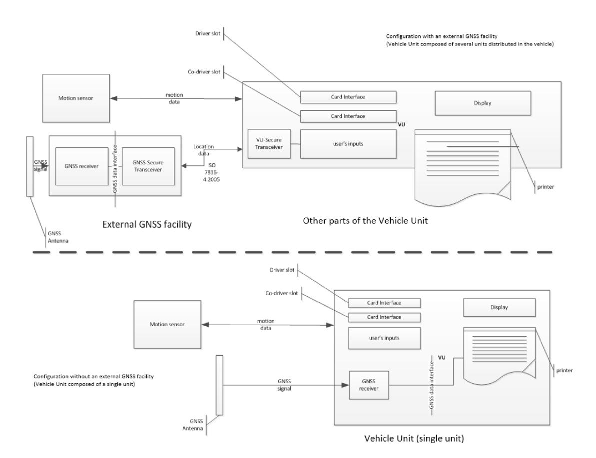
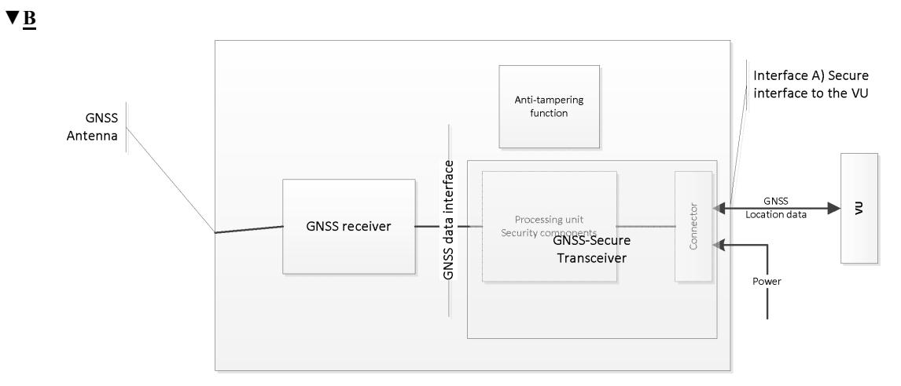

## *Appendix 12*

## **POSITIONING BASED ON GLOBAL NAVIGATION SATELLITE SYSTEM (GNSS)**

### TABLE OF CONTENT

- 1. INTRODUCTION
- 1.1. Scope

## **M3**

- 1.1.1 References
- 1.2. Acronyms and notations

## **M3**

**▼B**

- 2. BASIC CHARACTERISTICS OF THE GNSS RECEIVER
- 3. SENTENCES PROVIDED BY THE GNSS RECEIVER

## **B**

- 4. VEHICLE UNIT WITH AN EXTERNAL GNSS FACILITY
- 4.1. Configuration
- 4.1.1 Main components and interfaces
- 4.1.2 External GNSS facility state at the end of production
- 4.2. Communication between the external GNSS facility and the vehicle unit
- 4.2.1 Communication Protocol
- 4.2.2 Secure transfer of GNSS data
- 4.2.3 Structure of the Read Record command

# **M3**

- 4.2.4 Structure of the WriteRecord command
- 4.2.5 Other commands

# **B**

- 4.3. Coupling, mutual authentication and session key agreement of the external GNSS facility with vehicle unit
- 4.4. Error Handling
- 4.4.1 Communication error with the external GNSS facility
- 4.4.2 Breach of the physical integrity of the external GNSS facility
- 4.4.3 Absence of position information from GNSS receiver
- 4.4.4 External GNSS facility certificate expired
- 5. VEHICLE UNIT WITHOUT AN EXTERNAL GNSS FACILITY
- 5.1. Configuration

# **M3**

- 5.2. Transfer of information from the GNSS receiver to the VU
- 5.3. Transfer of information from the VU to the GNSS receiver
- 5.4. Error handling

- 5.4.1. Absence of position information from GNSS receiver
- 6. POSITION DATA PROCESSING AND RECORDING BY THE VU
- 7. GNSS TIME CONFLICT
- 8. VEHICLE MOTION CONFLICT
- 1. INTRODUCTION

This Appendix provides the technical requirements for the GNSS receiver and GNSS data used by the Vehicle Unit, including the protocols that must be implemented to assure the secure and correct data transfer of the positioning information.

- 1.1. **Scope**
  - GNS\_1 The Vehicle Unit shall collect location data from at least one GNSS satellite network.

The Vehicle Unit may be with or without an external GNSS facility as described in Figure 1:

1.1.1 *References*

The following references are used in this part of this Appendix.

NMEA NMEA (National Marine Electronics Association) 0183 Interface Standard, V4.11

### **B**

### *Figure 1*

### **Different configurations for GNSS receiver**

| ▼B  | 1.2. | Acronyms and notations                                                                                                                                                                                                                                                                                                                                                                                                                                                                                      |                                                         |
|-----|------|-------------------------------------------------------------------------------------------------------------------------------------------------------------------------------------------------------------------------------------------------------------------------------------------------------------------------------------------------------------------------------------------------------------------------------------------------------------------------------------------------------------|---------------------------------------------------------|
|     |      | The following acronyms are used in this appendix:                                                                                                                                                                                                                                                                                                                                                                                                                                                           |                                                         |
|     |      | DOP                                                                                                                                                                                                                                                                                                                                                                                                                                                                                                         | Dilution of Precision                                   |
|     |      | EGF                                                                                                                                                                                                                                                                                                                                                                                                                                                                                                         | Elementary file GNSS Facility                           |
|     |      | EGNOS                                                                                                                                                                                                                                                                                                                                                                                                                                                                                                       | European Geostationary Navigation Overlay Service       |
|     |      | GNSS                                                                                                                                                                                                                                                                                                                                                                                                                                                                                                        | Global Navigation Satellite System                      |
|     |      | GSA                                                                                                                                                                                                                                                                                                                                                                                                                                                                                                         | GPS DOP and active satellites                           |
|     |      | HDOP                                                                                                                                                                                                                                                                                                                                                                                                                                                                                                        | Horizontal Dilution of Precision                        |
|     |      | ICD                                                                                                                                                                                                                                                                                                                                                                                                                                                                                                         | Interface Control Document                              |
|     |      | NMEA                                                                                                                                                                                                                                                                                                                                                                                                                                                                                                        | National Marine Electronics Association                 |
| ▼M3 |      | OSNMA                                                                                                                                                                                                                                                                                                                                                                                                                                                                                                       | Galileo Open Service Navigation Messages Authentication |
| ▼B  |      | PDOP                                                                                                                                                                                                                                                                                                                                                                                                                                                                                                        | Position Dilution of Precision                          |
|     |      | RMC                                                                                                                                                                                                                                                                                                                                                                                                                                                                                                         | Recommended Minimum Specific                            |
| ▼M3 |      | RTC                                                                                                                                                                                                                                                                                                                                                                                                                                                                                                         | Real Time Clock                                         |
| ▼B  |      | SIS                                                                                                                                                                                                                                                                                                                                                                                                                                                                                                         | Signal in Space                                         |
|     |      | VDOP                                                                                                                                                                                                                                                                                                                                                                                                                                                                                                        | Vertical Dilution of Precision                          |
|     |      | VU                                                                                                                                                                                                                                                                                                                                                                                                                                                                                                          | Vehicle Unit                                            |
| ▼M3 | 2.   | BASIC CHARACTERISTICS OF THE GNSS RECEIVER                                                                                                                                                                                                                                                                                                                                                                                                                                                                  |                                                         |
| ▼B  |      | Regardless of the configuration of the Smart Tachograph with or without an external GNSS facility, the provision of accurate and reliable positioning information is an essential element of the effective operation of the Smart Tachograph. Therefore, it is appropriate to require its compatibility with the services provided by the Galileo and European Geostationary Navigation Overlay Service (EGNOS) programmes as set out in Regulation (EU) No 1285/2013 of the European Parliament and of the |                                                         |

- in Regulation (EU) No 1285/2013 of the European Parliament and of the Council (1). The system established under the Galileo programme is an independent global satellite navigation system and the one established under the EGNOS programme is a regional satellite navigation system improving the quality of the Global Positioning System signal.
- GNS\_2 Manufacturers shall ensure that the GNSS receivers in the Smart Tachographs are compatible with the positioning services provided by the Galileo and the EGNOS systems. Manufacturers may also choose, in addition, compatibility with other satellite navigation systems.

(1) Regulation (EU) No 1285/2013 of the European Parliament and of the Council of 11 December 2013 on the implementation and exploitation of European satellite navigation systems and repealing Council Regulation (EC) No 876/2002 and Regulation (EC) No 683/2008 of the European Parliament and of the Council (OJ L 347, 20.12.2013, p. 1).

- GNS\_3 The GNSS receiver shall have the capability to support Navigation Messages Authentication on the Open Service of Galileo (OSNMA).
- GNS\_3a The GNSS receiver shall perform a number of consistency checks in order to verify that the measurements computed by the GNSS receiver on the basis of the OSNMA data have resulted in the correct information about the position, velocity and data of the vehicle, and have therefore not been influenced by any external attack such as meaconing. These consistency checks shall consist, for instance, of:
  - detection of abnormal power emissions by means of combined monitoring of the Automatic Gain Control (AGC) and Carrier-to-Noise density ratio (C/N0),
  - pseudorange measurement consistency and Doppler measurement consistency over time, including the detection of abrupt measurement jumps,
  - receiver autonomous integrity monitoring (RAIM) techniques, including the detection of inconsistent measurements with the estimated position,
  - position and velocity checks, including abnormal position and velocity solutions, sudden jumps and behaviour not consistent with the dynamics of the vehicle,
  - time and frequency consistency, including clock jumps and drifts that are not consistent with the receiver clock characteristics.
- GNS\_3b The European Commission shall develop and approve the following documents:
  - A Signal in Space Interface Control Document (SIS ICD), specifying in detail the OSNMA information transmitted in the Galileo signal.
  - OSNMA Receiver Guidelines, providing the requirements and processes in the receivers to guarantee a secure implementation of OSNMA, as well as recommendations to enhance OSNMA performance.

GNSS receivers fitted in tachographs, either internal or external, shall be constructed in accordance with the SIS ICD and the OSNMA receiver guidelines.

- GNS\_3c The GNSS receiver shall provide position messages, called authenticated position messages in this Annex and its Appendixes, which are elaborated using only satellites from which the authenticity of the navigation messages has been successfully verified.
- GNS\_3d The GNSS receiver shall also provide standard position messages, elaborated using the satellites in view, regardless whether they are authenticated or not.

- GNS\_3e The GNSS receiver shall use the VU Real Time Clock (RTC) as time reference for the time synchronisation necessary for OSNMA.
- GNS\_3f The VU RTC time shall be provided to the GNSS receiver by the VU.
- GNS\_3g The maximal time drift specified in requirement 41 of Annex IC, shall be provided to the GNSS receiver by the VU, along with the VU RTC time.
- 3. SENTENCES PROVIDED BY THE GNSS RECEIVER

This section describes the sentences used in the functioning of the Smart Tachograph, for transmitting standard and authenticated position messages. This section is valid both for the configuration of the Smart Tachograph with or without an external GNSS facility.

GNS\_4 The standard position data is based on the NMEA sentence Recommended Minimum Specific (RMC) GNSS Data, which contains the Position information (Latitude, Longitude), Time in UTC format (hhmmss.ss), and Speed Over Ground in Knots plus additional values.

> The format of the RMC sentence is the following (as from NMEA V4.11 standard):

> > *Figure 2*

#### **Structure of the RMC sentence**

| 1 | 2 | 3 | 4 | 5 | 6 | 7 | 8 | 9 | 10 | 11 | 12 | 13 | 14 |
|---|---|---|---|---|---|---|---|---|----|----|----|----|----|
| ↓ | ↓ | ↓ | ↓ | ↓ | ↓ | ↓ | ↓ | ↓ | ↓  | ↓  | ↓  | ↓  | ↓  |

### \$ –RMC,hhmmss.ss,A,llll.ll,a,yyyyy.yy,a,x.x,x .x,xxxx,x.x,a,a,a\*hh

- (1) Time (UTC)
- (2) Status, A= Valid position, V= Warning
- (3) Latitude
- (4) N or S
- (5) Longitude
- (6) E or W
- (7) Speed over ground in knots
- (8) Track made good, degrees true
- (9) Date, ddmmyy
- (10) Magnetic Variation, degrees
- (11) E or W
- (12) FAA Mode Indicator
- (13) Navigational status
- (14) Checksum

The Status gives indication if the GNSS signal is available. Until the value of the Status is not set to 'A', the received data (e.g., on Time or Latitude/Longitude) cannot be used to record the position of the vehicle in the VU.

The resolution of the position is based on the format of the RMC sentence described above. The first part of the fields 3) and 5) are used to represent the degrees. The rest are used to represent the minutes with three decimals. So the resolution is 1/1 000 of minute or 1/60 000 of degree (because one minute is 1/60 of a degree).

GNS\_4a The authenticated position data is based on a NMEA-like sentence, Authenticated Minimum Specific (AMC) Data, which contains the Position information (Latitude, Longitude), Time in UTC format (hhmmss.ss), and Speed Over Ground in Knots plus additional values.

> The format of the AMC sentence is the following (as from NMEA V4.11 standard, except for value number 2):

#### *Figure 3*

#### **Structure of the AMC sentence**

| 1 | 2 | 3 | 4 | 5 | 6 | 7 | 8 | 9 | 10 | 11 | 12 | 13 | 14 |
|---|---|---|---|---|---|---|---|---|----|----|----|----|----|
| ↓ | ↓ | ↓ | ↓ | ↓ | ↓ | ↓ | ↓ | ↓ | ↓  | ↓  | ↓  | ↓  | ↓  |

\$–AMC,hhmmss.ss,A,llll.ll,a,yyyyy.yy,a,x.x,x.x,xxxx,x.x,a,a,a\*hh

- (1) Time (UTC)
- (2) Status, A=Authenticated position (established using at least 4 satellites from which the authenticity of the navigation messages has been successfully verified), J=jamming or O=other GNSS attack in the absence of failed authentication of navigation messages (by implemented consistency checks according to GNS\_3a), F=failed authentication of navigation messages (as detected by OSNMA verifications specified in the documents referred to in GNS\_3b), V=Void (authenticated position is not available for any other reason)
- (3) Latitude
- (4) N or S
- (5) Longitude
- (6) E or W
- (7) Speed over ground in knots
- (8) Track made good, degrees true
- (9) Date, ddmmyy
- (10) Magnetic Variation, degrees
- (11) E or W
- (12) FAA Mode Indicator
- (13) Navigational status
- (14) Checksum

The Navigational status is optional and may not be present in the AMC sentence.

The Status gives indication if an authenticated GNSS position is available, if an attack on the GNSS signals has been detected, if authentication of navigation messages has failed, or if GNSS position is void. When the value of the Status is not set to 'A', the received data (e.g. Time or Latitude/ Longitude) are considered to be not valid, and may not be used to record the position of the vehicle in the VU. When the value of the Status is set to 'J' (jamming), 'O' (other GNSS attack), or 'F' (failed authentication of navigation messages), a GNSS anomaly event shall be recorded in the VU, as defined in Annex IC and Appendix 1 (EventFaultCode).

GNS\_5 The Vehicle Unit shall store in the VU database the position information for latitude and longitude with a resolution of 1/10 of minute or 1/600 of a degree as described in Appendix 1 for type GeoCoordinates.

> The GPS DOP and active satellites (GSA) command, as from NMEA V4.11 standard, can be used by the VU to determine and record the signal availability and accuracy of standard positions. In particular the HDOP is used to provide an indication on the level of accuracy of the recorded location data (see 4.2.2). The VU will store the value of the Horizontal Dilution of Precision (HDOP) calculated as the minimum of the HDOP values collected on the available GNSS systems.

> The GNSS Id. indicates the corresponding NMEA Id. for every GNSS constellation and Satellite-Based Augmentation System (SBAS).

#### *Figure 4*

#### **Structure of the GSA sentence (standard positions)**

| 1 | 2 | 3 | 4 | 14 | 15 | 16 | 17 | 18 | 19 |
|---|---|---|---|----|----|----|----|----|----|
| ↓ | ↓ | ↓ | ↓ | ↓  | ↓  | ↓  | ↓  | ↓  | ↓  |

### \$ –GSA,a,a,x,x,x,x,x,x,x,x,x,x,x,x,x.x,x.x,x.x,a\*h h

- (1) Selection mode
- (2) Mode
- (3) ID of 1st satellite used for fix
- (4) ID of 2nd satellite used for fix
- …
- (14) ID of 12th satellite used for fix
- (15) PDOP
- (16) HDOP
- (17) VDOP
- (18) System ID
- (19) Checksum

The System ID is optional and may not be present in the GSA sentence.

Similarly, the NMEA-like sentence authenticated active satellites (ASA) command can be used by the VU to determine and record the signal availability and accuracy of authenticated positions. Values 1 to 18 are defined in NMEA V4.11 standard.

#### *Figure 5*

**Structure of the ASA sentence (authenticated positions)**

| 1 | 2 | 3 | 4 | 14 | 15 | 16 | 17 | 18 | 19 |
|---|---|---|---|----|----|----|----|----|----|
| ↓ | ↓ | ↓ | ↓ | ↓  | ↓  | ↓  | ↓  | ↓  | ↓  |

\$–ASA,a,a,x,x,x,x,x,x,x,x,x,x,x,x,x.x,x.x,x.x,a\*h h

- (1) Selection mode
- (2) Mode
- (3) ID of 1st satellite used for fix
- (4) ID of 2nd satellite used for fix
- …
- (14) ID of 12th satellite used for fix
- (15) PDOP
- (16) HDOP
- (17) VDOP
- (18) System ID
- (19) Checksum

The System ID is optional and may not be present in the ASA sentence.

- GNS\_6 When an external GNSS facility is used, the *GSA* sentence shall be stored in the GNSS Secure Transceiver with record number '02' to '06', and the ASA sentence shall be stored with record number '12' to '16'.
- GNS\_7 The maximum size of the sentences (e.g., RMC, AMC, GSA, ASA or others), which can be used for the sizing of the read record command shall be 85 bytes (see Table 1).

## **B**

**▼M3**

4. VEHICLE UNIT WITH AN EXTERNAL GNSS FACILITY

### 4.1. **Configuration**

4.1.1 *Main components and interfaces*

In this configuration, the GNSS receiver is a part of the external GNSS facility.

- GNS\_8 The external GNSS facility must be powered with a specific vehicle interface.
- GNS\_9 The external GNSS facility shall consist of the following components (see Figure 6):

| ▼M3   |        | (a) A commercial GNSS receiver to provide the position data through the GNSS data interface. For example, the GNSS data interface can be NMEA standard V4.11 where the GNSS receiver acts as a talker and transmits NMEA sentences to the GNSS Secure Trans- ceiver with a frequency of 1Hz for the pre-defined set of NMEA and NMEA-like sentences, which must include at least the RMC, AMC, GSA and ASA sentences. The implementation of the GNSS data interface is a choice of the manufacturers of the external GNSS facility. |
|-------|--------|-------------------------------------------------------------------------------------------------------------------------------------------------------------------------------------------------------------------------------------------------------------------------------------------------------------------------------------------------------------------------------------------------------------------------------------------------------------------------------------------------------------------------------------|
| ▼B    |        | (b) A transceiver unit (GNSS Secure Transceiver) with the capability to support standard ISO/IEC 7816-4:2013 (see 4.2.1) to communicate with the vehicle unit and support the GNSS data interface to the GNSS receiver. The unit is provided with a memory to store the identi- fication data of the GNSS receiver and external GNSS facility.                                                                                                                                                                                      |
| ▼M3   |        | (c) An enclosure system with tamper detection function, which encapsulates both the GNSS receiver and the GNSS Secure Transceiver. The tamper detection function shall implement the security protection measures as requested in the Protection Profile of the Smart Tachograph.                                                                                                                                                                                                                                                   |
| ▼B    | GNS_10 | (d) A GNSS antenna installed on the vehicle and connected to the GNSS receiver through the enclosure system. The external GNSS facility has at least the following external interfaces: (a) the interface to the GNSS antenna installed on the vehicle truck, if an external antenna is used. (b) the interface to the Vehicle Unit.                                                                                                                                                                                       |
|       | GNS_11 | In the VU, the VU Secure Transceiver is the other end of the secure communication with the GNSS Secure Trans- ceiver and it must support ISO/IEC 7816-4:2013 for the connection to the external GNSS facility.                                                                                                                                                                                                                                                                                                                      |
|       | GNS_12 | For the physical layer of the communication with the external GNSS facility, the vehicule unit shall support ISO/IEC 7816-12:2005 or another standard able to support ISO/IEC 7816-4:2013. (see 4.2.1).                                                                                                                                                                                                                                                                                                                             |
| 4.1.2 | GNS_13 | External GNSS facility state at the end of production The external GNSS facility shall store the following values in the non-volatile memory of the GNSS Secure Trans- ceiver when it leaves the factory: — the EGF_MA key pair and corresponding certificate, — the MSCA_VU-EGF certificate containing the MSCA_VU-EGF.PK public key to be used for verifi- cation of the EGF_MA certificate, — the EUR certificate containing the EUR.PK public key to be used for verification of the MSCA VU-EGF certificate,       |

- the EUR certificate whose validity period directly precedes the validity period of the EUR certificate to be used to verify the MSCA\_VU-EGF certificate, if existing,
- the link certificate linking these two EUR certificates, if existing,
- the extended serial-number of the external GNSS facility,
- operating system identifier of the GNSS facility,
- type approval number of the external GNSS facility;
- Identifier of the security component of the external GNSS module.

#### 4.2. **Communication between the external GNSS facility and the vehicle unit**

4.2.1 *Communication Protocol*

**▼M3**

- GNS\_14 The communication protocol between the external GNSS facility and the vehicle unit shall support the following functions:
  - 1. The collection and distribution of GNSS data (e.g., position, timing, speed),
  - 2. The collection of the configuration data of the external GNSS facility,
  - 3. The management protocol to support the coupling, mutual authentication and session key agreement between the external GNSS facility and the VU,
  - 4. The transmission to the external GNSS facility of the VU RTC time and of the maximal difference between true time and the VU RTC time.

- **▼B**
- GNS\_15 The communication protocol shall be based on standard ISO/IEC 7816-4:2013 with the VU Secure Transceiver playing the master role and the GNSS Secure Transceiver playing the slave role. The physical connection between the external GNSS facility and the vehicule unit is based on ISO/IEC 7816-12:2005 or another standard able to support ISO/IEC 7816-4:2013

## **M1**

- GNS\_16 In the communication protocol, extended length fields shall not be supported.
- GNS\_17 The communication protocol of ISO 7816 (both \*-4:2013 and \*-12:2005) between the external GNSS facility and the VU shall be set to T = 1.

## **B**

|     |         | File Structure                                                                                                                                                                                                                                                                                                                                                                                                                                                                                                                                                                                |
|-----|---------|-----------------------------------------------------------------------------------------------------------------------------------------------------------------------------------------------------------------------------------------------------------------------------------------------------------------------------------------------------------------------------------------------------------------------------------------------------------------------------------------------------------------------------------------------------------------------------------------------|
| ▼M1 | GNS_18  | Regarding the functions 1) the collection and distribution of GNSS data and 2) the collection of the configuration data of the external GNSS facility and 3) management protocol, the GNSS Secure Transceiver shall simulate a smart card with a file system architecture composed by a Master File (MF), a Dedicated File (DF) with Application Identifier specified in Appendix 1 chapter 6.2 ('FF 44 54 45 47 4D') and with 3 EFs containing certificates and one single Elementary File (EF.EGF) with file identifier equal to '2F2F' as described in Table 1. |
| ▼M3 | GNS_18a | Regarding the function 4) the transmission to the external GNSS facility of the VU RTC time and of the maximal difference between true time and the VU RTC time, the GNSS Secure Transceiver shall use an EF (EF VU) in the same DF with file identifier equal to '2F30' as described in Table 1.                                                                                                                                                                                                                                                                              |
| ▼B  | GNS_19  | The GNSS Secure Transceiver shall store the data coming from the GNSS receiver and the configuration in the EF.EGF. This is a linear, variable-length record file with an identifier equal to '2F2F' in hexadecimal format.                                                                                                                                                                                                                                                                                                                                                          |
| ▼M3 | GNS_19a | The GNSS Secure Transceiver shall store the data coming from the VU in the EF VU. This is a linear, fixed-length record file with an identifier equal to '2F30' in hexadecimal format.                                                                                                                                                                                                                                                                                                                                                                                               |
|     | GNS_20  | The GNSS Secure Transceiver shall use a memory to store the data and be able to perform as many read/write cycles as needed during a lifetime of at least 15 years. Apart from this aspect, the internal design and implementation of the GNSS Secure Transceiver is left to the manufacturers.                                                                                                                                                                                                                                                                                   |
| ▼M1 |         | The mapping of record numbers and data is provided in Table 1. Note that there are five GSA sentences for the GNSS constellations and Satellite-Based Augmentation System (SBAS).                                                                                                                                                                                                                                                                                                                                                                                                    |
| ▼B  | GNS_21  | The file structure is provided in Table 1. For the access conditions (ALW, NEV, SM-MAC) see Appendix 2 chapter 3.5.                                                                                                                                                                                                                                                                                                                                                                                                                                                                     |
| ▼M3 |         | Table 1                                                                                                                                                                                                                                                                                                                                                                                                                                                                                                                                                                                       |

|                                                                               |           | Access conditions |                |                   |  |
|-------------------------------------------------------------------------------|-----------|-------------------|----------------|-------------------|--|
| File                                                                          | File ID   | Read              | Update         | Encrypted         |  |
| MF                                                                            | 3F00      |                   |                |                   |  |
| EF.ICC                                                                        | 0002      | ALW               | NEV (by VU) | No                |  |
|                                                                               |           | Access conditions |                |                   |  |
| File                                                                          | File ID   | Read              | Update         | Encrypted         |  |
| DF GNSS Facility                                                              | 0501      | ALW               | NEV            | No                |  |
| EF EGF_MACertificate                                                          | C100      | ALW               | NEV            | No                |  |
| EF CA_Certificate                                                             | C108      | ALW               | NEV            | No                |  |
| EF Link_Certificate                                                           | C109      | ALW               | NEV            | No                |  |
| EF EGF                                                                        | 2F2F      | SM-MAC            | NEV (by VU) | No                |  |
| EF VU                                                                         | 2F30      | SM-MAC            | SM-MAC         | No                |  |
|                                                                               |           |                   |                |                   |  |
| File / Data element                                                           | Record no | Size (bytes)      |                | Default values |  |
|                                                                               |           | Min               | Max            |                   |  |
| MF                                                                            |           | 552               | 1031           |                   |  |
| EF.ICC                                                                        |           |                   |                |                   |  |
| sensorGNSSSerialNumber                                                        |           | 8                 | 8              |                   |  |
|                                                                               |           |                   |                |                   |  |
| DF GNSS Facility                                                              |           | 612               | 1023           |                   |  |
| EF EGF_MACertificate                                                          |           | 204               | 341            |                   |  |
| EGFCertificate                                                                |           | 204               | 341            | {00..00}          |  |
| EF CA_Certificate                                                             |           | 204               | 341            |                   |  |
| MemberStateCertificate                                                        |           | 204               | 341            | {00..00}          |  |
| EF Link_Certificate                                                           |           | 204               | 341            |                   |  |
| LinkCertificate                                                               |           | 204               | 341            | {00..00}          |  |
|                                                                               |           |                   |                |                   |  |
| EF EGF                                                                        |           |                   |                |                   |  |
| RMC NMEA Sentence                                                             | '01'      | 85                | 85             |                   |  |
| 1st GSA NMEA Sentence                                                         | '02'      | 85                | 85             |                   |  |
| 2nd GSA NMEA Sentence                                                         | '03'      | 85                | 85             |                   |  |
| 3rd GSA NMEA Sentence                                                         | '04'      | 85                | 85             |                   |  |
| 4th GSA NMEA Sentence                                                         | '05'      | 85                | 85             |                   |  |
| 5th GSA NMEA Sentence                                                         | '06'      | 85                | 85             |                   |  |
| Extended serial-number of the external GNSS facility defined in Appendix 1 | '07'      | 8                 | 8              |                   |  |

| File / Data element                                                                                                         | Record no         | Size (bytes) | Default values |
|-----------------------------------------------------------------------------------------------------------------------------|-------------------|--------------|----------------|
| Operating system identifier of the GNSS Secure Transceiver defined in Appendix 1 as SensorOSIdentifier.                     | '08'              | 2            | 2              |
| Type approval number of the external GNSS facility defined in Appendix 1 as SensorExternalGNSSApproval-Number.              | '09'              | 16           | 16             |
| Identifier of the security component of the external GNSS facility defined in Appendix 1 as SensorExternalGNSS-SCIdentifier | '10'              | 8            | 8              |
| AMC Sentence                                                                                                                | '11'              | 85           | 85             |
| 1st ASA Sentence                                                                                                            | '12'              | 85           | 85             |
| 2nd ASA Sentence                                                                                                            | '13'              | 85           | 85             |
| 3rd ASA Sentence                                                                                                            | '14'              | 85           | 85             |
| 4th ASA Sentence                                                                                                            | '15'              | 85           | 85             |
| 5th ASA Sentence                                                                                                            | '16'              | 85           | 85             |
| RFU – Reserved for Future Use                                                                                               | From '17' to 'FD' |              |                |
| EF VU                                                                                                                       |                   |              |                |
| VuRtcTime (see Appendix 1)                                                                                                  | '01'              | 4            | {00..00}       |
| VuGnssMaximalTimeDifference (see Appendix 1)                                                                                | '02'              | 2            | {00..00}       |

### **B**

#### 4.2.2 *Secure transfer of GNSS data*

**▼M3**

- 1. The coupling process has been completed as described in Appendix 11. Common security mechanisms.
- 2. The periodic mutual authentication and session key agreement between the VU and the external GNSS facility also described in Appendix 11. Common security mechanisms has been executed with the indicated frequency.

## **M3**

GNS\_22 The secure transfer of GNSS position data, VU RTC time and maximal time difference between true time and the VU RTC time shall be allowed only in the following conditions:

- GNS\_23 Every T seconds, where T is a value lower or equal to 20, unless coupling or mutual authentication and session key agreement takes place, the VU requests from the external GNSS facility the position information on the basis of the following flow:
  - 1. The VU requests position data from the External GNSS facility together with Dilution of Precision data (from the GSA and ASA sentences). The VU Secure Transceiver shall use the ISO/IEC 7816-4:2013 SELECT and READ RECORD(S) commands in secure messaging authentication-only mode as described in section 11.5 of Appendix 11 with the file identifier '2F2F' and RECORD number equal to '01' for RMC NMEA sentence, '02','03','04','05','06' for GSA NMEA sentence, '11' for AMC sentence, and '12','13','14','15','16' for ASA sentence.
  - 2. The last position data received is stored in the EF with identifier '2F2F' and the records described in Table 1 in the GNSS secure transceiver as the GNSS secure transceiver receives NMEA data with a frequency of at least 1 Hz from the GNSS receiver through the GNSS data interface.
  - 3. The GNSS Secure Transceiver sends the response to the VU Secure Transceiver by using the APDU response message in secure messaging authentication-only mode as described in section 11.5 of Appendix 11.
  - 4. The VU Secure Transceiver checks the authenticity and integrity of the received response. In case of positive outcome, the position data is transferred to the VU processor through the GNSS data interface.
  - 5. The VU processor checks the received data extracting the information (e.g., latitude, longitude, time) from the RMC NMEA sentence. The RMC NMEA sentence includes the information if the non-authenticated position is valid. If the non-authenticated position is valid, the VU processor also extracts the values of HDOP from GSA NMEA sentences and calculates the minimum value on the available satellite systems (i.e., when the fix is available).
  - 6. The VU processor also extracts the information (e.g., latitude, longitude, time) from the AMC sentence. The AMC sentence includes the information if the authenticated position is not valid or GNSS signal has been attacked. If the position is valid, the VU processor also extracts the values of HDOP from ASA sentences and calculates the minimum value on the available satellite systems (i.e., when the fix is available).

GNS\_23a The VU shall also write VU RTC time and maximal time difference between true time and the VU RTC time as needed, by using the ISO/IEC 7816-4:2013 SELECT and WRITE RECORD(S) commands in secure messaging authentication-only mode as described in section 11.5 of Appendix 11 with the file identifier '2F30' and RECORD number equal to '01' for VuRtcTime and '02' for MaximalTimeDifference.

### **B**

#### 4.2.3 *Structure of the Read Record command*

This section describes in detail the structure of the Read Record command. Secure messaging (authentication-only mode) is added as described in Appendix 11 Common security mechanisms.

GNS\_24 The command shall support the Secure Messaging authentication-only-mode, see Appendix 11.

| Byte | Length | Value | Description                                            |
|------|--------|-------|--------------------------------------------------------|
| CLA  | 1      | '0Ch' | Secure messaging asked.                                |
| INS  | 1      | 'B2h' | Read Record                                            |
| P1   | 1      | 'XXh' | Record number ('00' references the current record)     |
| P2   | 1      | '04h' | Read the record with the record number indicated in P1 |
| Le   | 1      | 'XXh' | Length of data expected. Number of Bytes to be read.   |

GNS\_25 Command Message

GNS\_26 The record referenced in P1 becomes the current record.

| Byte  | Length | Value     | Description            |
|-------|--------|-----------|------------------------|
| #1-#X | X      | 'XX..XXh' | Data read              |
| SW    | 2      | 'XXXXh'   | Status Words (SW1,SW2) |

— If the command is successful, the GNSS secure transceiver returns '**9000**'.

- If the current file is not record oriented, the GNSS secure transceiver returns **'6981'**.
- If the command is used with P1 = '00' but there is no current EF the GNSS secure transceiver returns **'6986'** (command not allowed).

## **M3**

\_\_\_\_\_\_\_\_\_\_

- If the record is not found, the GNSS secure transceiver returns '6A83'.
- If the external GNSS facility has detected tampering, it shall return status words '6690'.

#### 4.2.4 *Structure of the WriteRecord command*

This section describes in detail the structure of the Write Record command. Secure messaging (authentication-only mode) is added as described in Appendix 11 Common security mechanisms.

GNS\_26a The command shall support the Secure Messaging authentication-only-mode, see Appendix 11.

GNS\_26b Command Message

| Byte | Length | Value | Description                                                |
|------|--------|-------|------------------------------------------------------------|
| CLA  | 1      | '0Ch' | Secure messaging asked.                                    |
| INS  | 1      | 'D2h' | Write Record                                               |
| P1   | 1      | 'XXh' | Record number ('00' references the current record)      |
| P2   | 1      | '04h' | Write the record with the record number indicated in P1 |
| Data | X      | 'XXh' | Data                                                       |

GNS\_26c The record referenced in P1 becomes the current record.

| Byte | Length | Value   | Description            |
|------|--------|---------|------------------------|
| SW   | 2      | 'XXXXh' | Status Words (SW1,SW2) |

- If the command is successful, the GNSS secure transceiver returns '**9000**'.
- If the current file is not record oriented, the GNSS secure transceiver returns **'6981'**.
- If the command is used with P1 = '00' but there is no current EF the GNSS secure transceiver returns **'6986'** (command not allowed).
- If the record is not found, the GNSS secure transceiver returns **'6A83'**.
- If the external GNSS facility has detected tampering, it shall return status words **'6690'**.

### 4.2.5 *Other commands*

GNS\_27 The GNSS Secure Transceiver shall support the following tachograph generation 2 commands specified in Appendix 2:

| Command                 | Reference                 |
|-------------------------|---------------------------|
| Select                  | Appendix 2 chapter 3.5.1  |
| Read Binary             | Appendix 2 chapter 3.5.2  |
| Get Challenge           | Appendix 2 chapter 3.5.4  |
| PSO: Verify Certificate | Appendix 2 chapter 3.5.7  |
| External Authenticate   | Appendix 2 chapter 3.5.9  |
| General Authenticate    | Appendix 2 chapter 3.5.10 |
| MSE:SET                 | Appendix 2 chapter 3.5.11 |

### 4.3. **Coupling, mutual authentication and session key agreement of the external GNSS facility with vehicle unit**

The coupling, mutual authentication and session key agreement of the external GNSS facility with the vehicle unit is described in Appendix 11. Common security mechanisms, Chapter 11.

### 4.4. **Error Handling**

This section describes how potential error conditions by the external GNSS facility are addressed and recorded in the VU.

4.4.1 *Communication error with the external GNSS facility*

**▼M3**

GNS\_28 A communication error with the external GNSS facility event shall be recorded in the VU, as defined in requirement 82 of Annex IC and Appendix 1 (Event-FaultType). In this context, a communication error is triggered when the VU Secure Transceiver does not receive a response message after a request message as described in 4.2.

**▼B**

**▼M3**

- 4.4.2 *Breach of the physical integrity of the external GNSS facility*
  - GNS\_29 If the external GNSS facility has been breached, the GNSS Secure Transceiver shall ensure that cryptographic material is unavailable. As described in GNS\_25 and GNS\_26, the VU shall detect tampering if the Response has status '6690'. The VU shall then generate and record a security breach attempt event as defined in requirement 85 of Annex IC and Appendix 1 (EventFaultType for tamper detection of GNSS). Alternately, the external GNSS facility may respond to VU requests without secure messaging and with status '6A88'.

## **B**

4.4.3 *Absence of position information from GNSS receiver*

**▼M3**

GNS\_30 If the GNSS Secure Transceiver does not receive data from the GNSS receiver, the GNSS Secure Transceiver shall generate a response message to the READ RECORD command with RECORD number equal to '01' with a Data Field of 12 bytes all set to 0xFF. Upon reception of the Response message with this value of the data field, the VU shall generate and record an absence of position information from GNSS receiver event, as defined in requirement 81 of Annex IC and Appendix 1 (EventFaultType).

**▼B**

4.4.4 *External GNSS facility certificate expired*

**▼M3**

GNS\_31 If the VU detects that the EGF certificate used for mutual authentication is not valid any longer, the VU shall generate and record a security breach attempt event as defined in requirement 85 of Annex IC and Appendix 1 (EventFaultType for external GNSS facility certificate expired). The VU shall still use the received GNSS position data.

### *Figure 6*

### **Schema of the external GNSS facility**

#### 5. VEHICLE UNIT WITHOUT AN EXTERNAL GNSS FACILITY

### 5.1. **Configuration**

In this configuration, the GNSS receiver is inside the Vehicle Unit as described in Figure 1.

**▼M3**

GNS\_32 For transmitting position, DOP and satellites data, the GNSS receiver shall act as a talker and transmit NMEA or NMEA-like sentences to the VU processor, which shall act as a listener with a frequency of 1/10 Hz or faster for the pre-defined set of sentences, which shall include at least the RMC, GSA, AMC and ASA sentences. Alternatively, the VU processor and the internal GNSS receiver may use other data formats to exchange the data contained in the NMEA or NMEA-like sentences specified in GNS\_4, GNS\_4a and GNS\_5.

## **B**

GNS\_33 An external GNSS antenna installed on the vehicle or an internal GNSS antenna shall be connected to the VU.

## **M3**

### 5.2. **Transfer of information from the GNSS receiver to the VU**

- GNS\_34 The VU processor checks the received data extracting the information (e.g., latitude, longitude, time) from the RMC NMEA sentence and the AMC sentence.
- GNS\_35 The RMC NMEA sentence includes the information if the non-authenticated position is valid. If the non-authenticated position is not valid, the position data is not available and it cannot be used to record the position of the vehicle. If the non-authenticated position is valid, the VU processor also extracts the values of HDOP from GSA NMEA.
- GNS\_36 The VU processor also extracts the information (e.g. latitude, longitude, time) from the AMC sentence. The AMC sentence includes the information if the non-authenticated position is valid according to GNS\_4a. If the non-authenticated position is valid, the VU processor also extracts the values of HDOP from ASA sentences.

### 5.3. **Transfer of information from the VU to the GNSS receiver**

GNS\_37 The VU processor provides to the GNSS receiver the VU RTC time and the maximal difference between true time and the VU RTC time, in accordance with GNS\_3f and GNS\_3g.

### 5.4. **Error handling**

- 5.4.1 Absence of position information from GNSS receiver
  - GNS\_38 The VU shall generate and record an absence of position information from GNSS receiver event, as defined in requirement 81 of Annex IC and Appendix 1 (Event-FaultType).

6. POSITION DATA PROCESSING AND RECORDING BY THE VU

This section is valid both for the configuration of the Smart Tachograph with or without an external GNSS facility.

- GNS\_39 Position data shall be stored in the VU, together with a flag indicating if the position has been authenticated. When position data need to be recorded in the VU, the following rules shall apply:
  - (a) If both authenticated and standard positions are valid and consistent, the standard position and its accuracy shall be recorded in the VU and the flag shall be set to 'authenticated'.
  - (b) If both authenticated and standard positions are valid but not consistent, the VU shall store the authenticated position and its accuracy, and the flag shall be set to 'authenticated'.
  - (c) If the authenticated position is valid and the standard position is not valid, the VU shall record the authenticated position and its accuracy, and the flag shall be set to 'authenticated'.
  - (d) If the standard position is valid and the authenticated position is not valid, the VU shall record the standard position and its accuracy, and the flag shall be set to 'not authenticated'.

Authenticated and standard positions are considered as consistent, as shown in Figure 7, when the horizontal authenticated position can be found in a circle centered at the horizontal standard position, which radius results of rounding up to the nearest upper whole number the value of R\_H calculated according to the following formula:

### R\_H = 1.74 • σUERE • HDOP

where:

- R\_H is the relative radius of a circle around the estimated horizontal position, in meters. It is an indicator that is used to check consistency between standard and authenticated positions.
- σUERE is the standard deviation for the user equivalent range error (UERE), which models all measurement errors for the target application, including urban environments. A constant value of σUERE = 10 meters shall be used.

— HDOP is the horizontal dilution of precision calculated by the GNSS receiver.

— σUERE . HDOP is the estimation of the root mean squared error in the horizontal domain.

#### *Figure 7*

### **Consistent Authenticated and Standard (non-authenticated) positions**

GNS\_40 When the value of the Status in a received AMC sentence is set to 'J' or 'O' or 'F' in accordance with requirement GNS\_4a, the VU shall generate and record a GNSS anomaly event, as defined in requirement 88a of Annex IC and Appendix 1 (EventFaultType). The vehicle unit may perform additional checks before storing a GNSS anomaly event following the reception of a 'J' or 'O' setting.

### 7. GNSS TIME CONFLICT

GNS\_41 If the VU detects a discrepancy between the time of the vehicle unit's time measurement function and the time originating from the GNSS signals, it shall generate and record a time conflict event, as defined in requirement 86 of Annex IC and Appendix 1 (EventFaultType).

### 8. VEHICLE MOTION CONFLICT

GNS\_42 The VU shall trigger and record a Vehicle Motion Conflict event in accordance with requirement 84 of Annex IC, in case motion information calculated from the motion sensor is contradicted by motion information calculated from the internal GNSS receiver, from the external GNSS facility, or by other independent motion source(s) as set out in requirement 26 of Annex IC.

> The vehicle motion conflict event shall be triggered upon occurrence of one of the following trigger conditions:

#### Trigger condition 1:

The trimmed mean value of the speed differences between these sources shall be used, when the position information from the GNSS receiver is available and when the ignition of the vehicle is switched on, as specified below:

- every 10 seconds maximum, the absolute value of the difference between the vehicle speed estimated from the GNSS and the one estimated from the motion sensor shall be computed.
- all the computed values in a time window containing the last 5 minutes of vehicle movement shall be used to compute the trimmed mean value.
- the trimmed mean value shall be computed as the average of 80% of the remaining values, after having eliminated the highest ones in absolute values.

The Vehicle Motion Conflict event shall be triggered if the trimmed mean value is above 10 km/h for five uninterrupted minutes of vehicle movement. (Note: the use of the trimmed mean on the last 5 minutes is applied to mitigate the risk of measurement outliers and transient values).

For the trimmed mean computation, the vehicle shall be considered as moving if at least one vehicle speed value estimated either from motion sensor or from GNSS receiver is not equal to zero.

#### Trigger condition 2:

The vehicle motion conflict event shall also be triggered if the following condition is true:

*GnssDistance*>[*OdometerDifference*×*OdometerTolerance-Factor*+*Minimum* (*SlipDistanceUpperlimit*;(*OdometerDifference*×*SlipFactor*))+*GnssTolerance*+*FerryTrainDistance*]

where:

- — *GnssDistance* is the distance between the current position of the vehicle and the previous one, both obtained from valid authenticated position messages, without considering the height,
- OdometerDifference is the difference between the current odometer value and the odometer value corresponding to the previous valid authenticated position message,
- OdometerToleranceFactor is equal to 1.1 (worst case tolerance factor for all measurement tolerances of the vehicle odometer),
- GnssTolerance is equal to 1 km (worst case GNSS tolerance),

- Minimum (SlipDistanceUpperLimit; (OdometerDifference \* SlipFactor)) is the minimum value between:
  - SlipDistanceUpperLimit which is equal to 10 km (upper limit of the slip distance caused by slipping effects during braking),
  - and OdometerDifference \* SlipFactor, in which SlipFactor is equal to 0.2 (maximal influence of slipping effects during breaking),
- FerryTrainDistance is computed as: FerryTrainDistance =200km/h \* tFerryTrain, where tFerryTrain is the sum of the durations in hours of the ferry/train crossings in the considered time interval. The duration of a ferry/train crossings is defined as the time difference between its end flag and its beginning flag.

The preceding verifications shall be performed every 15 minutes if the necessary position data are available, otherwise as soon as the position data are available.

For this trigger condition:

- date and time of beginning of event shall be equal to the date and time when the previous position message was received,
- date and time of end of event shall be equal to the date and time when the checked condition becomes false again.

#### Trigger condition 3:

The vehicle unit encounters a discrepancy consisting of the motion sensor not detecting any movement and the independent motion source detecting movement for a specific period. The conditions to record a discrepancy as well as the period of detection of the discrepancy shall be set out by the vehicle unit manufacturer, although the discrepancy shall be detected in no more than three hours.